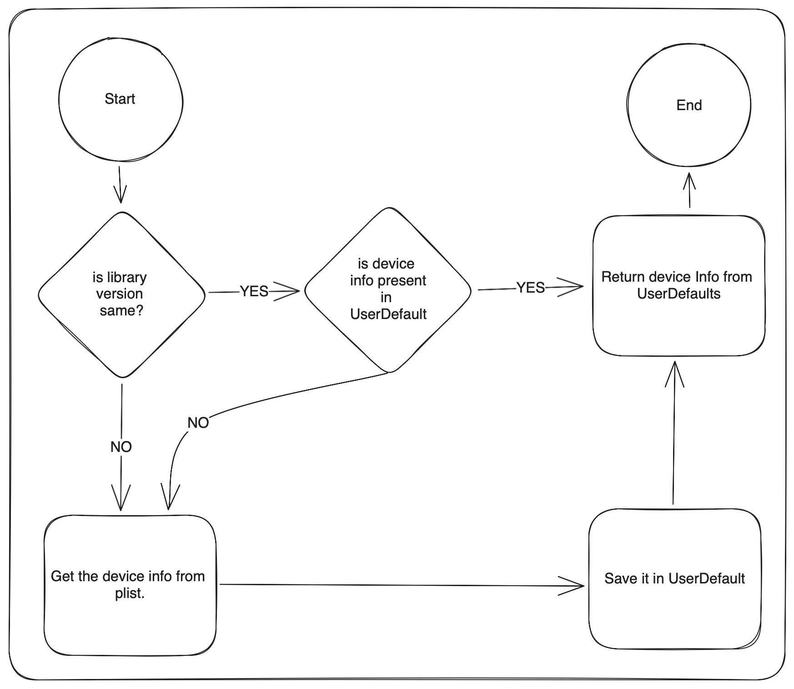

# DeviceGuru

***DeviceGuru*** is a simple lib (Swift) to know the exact type of the device, e.g. iPhone 6 or iPhone 6s
  - Easy to use
  - Light weight

### 10.0.0 Release

10.0.0 Introduced breaking changes so if you're using older version 8.x.x then you need to make little changes. Check this PR: https://github.com/InderKumarRathore/DeviceGuru/pull/94 for changes. With 10.0.0 The library is 10x faster and you can mock DeviceGuru for testing also.

### Flow
<details close>
  <summary>Expand</summary>
  
</details>

### Installation

##### Using Swift Package Manager
Add to Package.swift:

```swift
.Package(url: "https://github.com/InderKumarRathore/DeviceGuru", branch: "master")
```

##### Using CocoaPods
Copy the pod dependency and add that to your pod file. e.g.

```sh
pod 'DeviceGuru'
```
then run the below command in terminal
```sh
pod install
```

##### Using Carthage
Specify DeviceGuru into your project's `Cartfile`:

```ogdl
github "InderKumarRathore/DeviceGuru"
```

##### Manually
Drag and drop this folder
``` swift
Sources
```

files in your project

### Usage
If you install from *CocoaPods*, you have to import the module. If you used drag and drop then there is no need of import
``` swift
import DeviceGuru
```
In your code:
``` swift
let deviceGuru = DeviceGuruImplementation()
let deviceName = deviceGuru.hardware
let deviceCode = deviceGuru.hardwareString
let platform = deviceGuru.platform
print("\(deviceName) - \(deviceCode) - \(platform)")
```
Checkout [`Example Project`](Example/)!


### Development

Want to contribute? Great!
Just update the `GeneratorDevice.plist`

Then
```sh
cd Generator
./main.swift
```
The above command will auto generate the required code

Send the pull request 🚀


### License
DeviceGuru is available under the MIT license. See the LICENSE file for more info.
